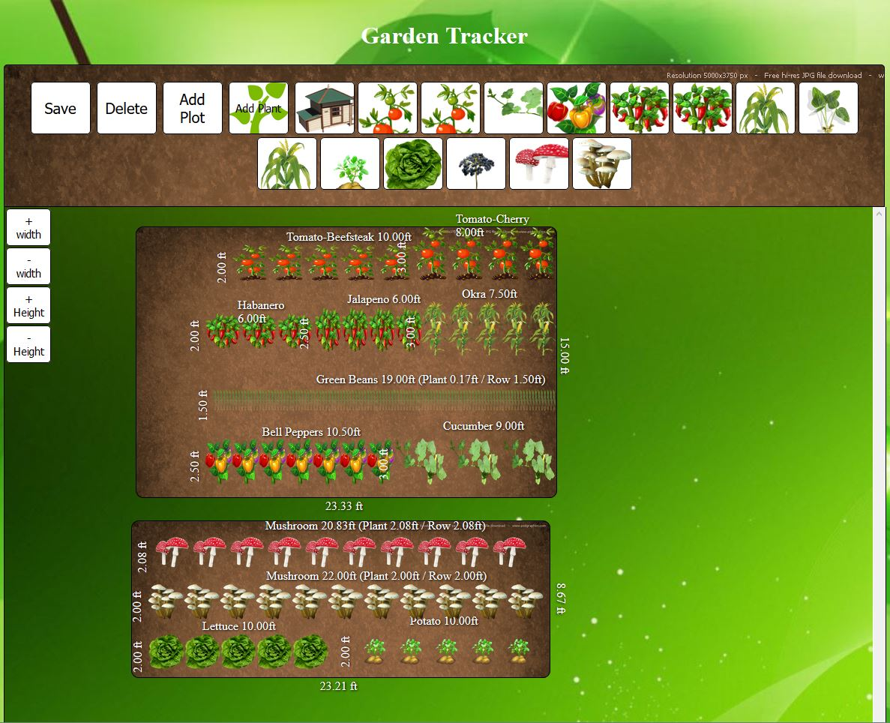

# GardenCreator
Web interface that would control and monitor a home garden.
The idea behind this project is to host a site/interface on a raspberry pi apache server and be able to plan a garden to scale, control/monitor watering, temperature, moisture level, and crop statistics.  
Many gardeners may not have consistent internet connectivity and would benefit from a stand alone device that could be accessed over a home router.  

