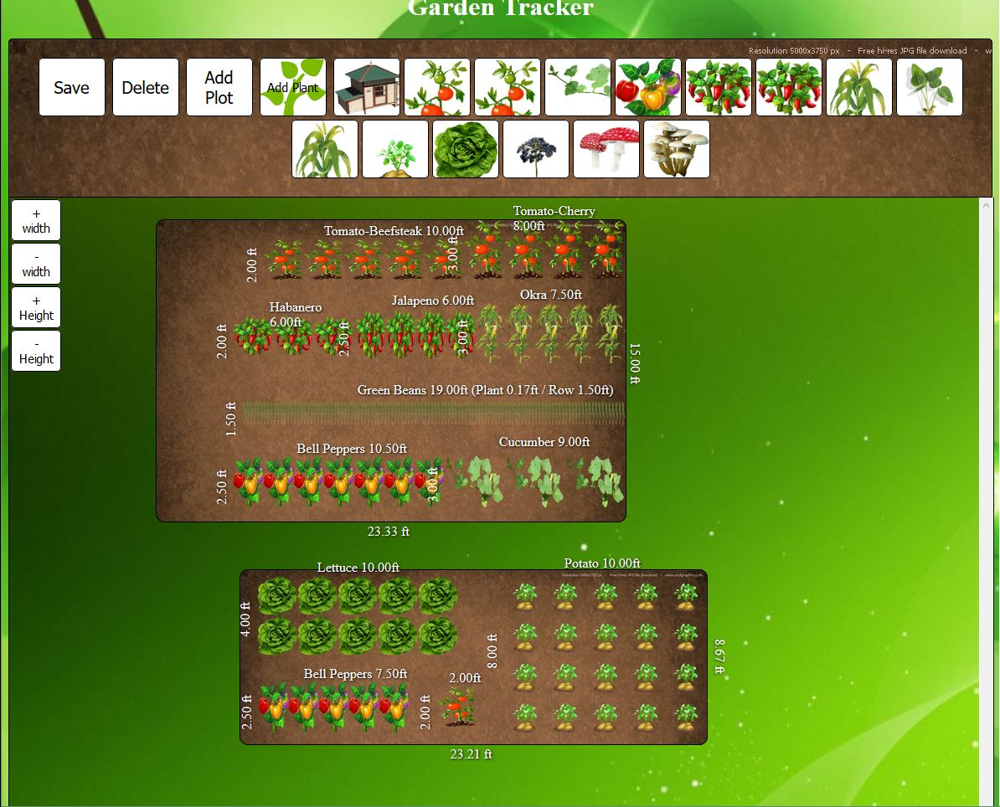

# GardenCreator
Web interface that would control and monitor a home garden.
The idea behind this project is to host a site on a raspberry pi apache server. The user should be able to plan a garden to scale, control/monitor watering(pumps), temperature, moisture level, and crop statistics.  Because the interface is accessed over a home router it would be beneficial to users with non-existent or intermittent web connectivity.   

